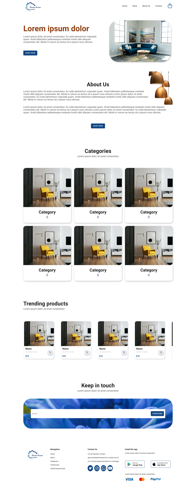

## Reference UI Link
https://www.figma.com/community/file/1311447601949155978

## Home Page

## FOLDER STRUCTURE
src/
|-- components/
|   |-- icons/
|   |-- shared/
|       |-- forms/
|       |   |-- InputForm.js
|       |   |-- SelectForm.js
|       |   |-- TextAreaForm.js
|       |
|       |-- buttons/
|       |   |-- PrimaryButton.js
|       |   |-- SecondaryButton.js
|       |
|       |-- typography/
|           |-- Heading.js
|           |-- Paragraph.js
|
|   |-- layouts/
|       |-- MainLayout.js
|       |-- AuthLayout.js
|       |
|       |-- components/
|           |-- Header.js
|           |-- Footer.js
|
|   |-- sections/
|       |-- HomeSection.js
|       |-- AboutSection.js
|       |-- ContactSection.js
|
|-- pages/
|   |-- Home.js
|   |-- About.js
|   |-- Contact.js
|
|-- App.js
|-- index.js
|-- styles/
    |-- main.scss
